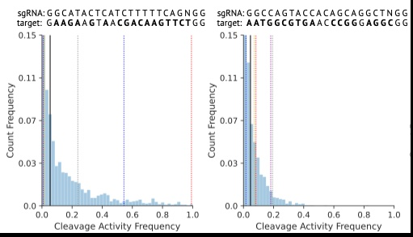
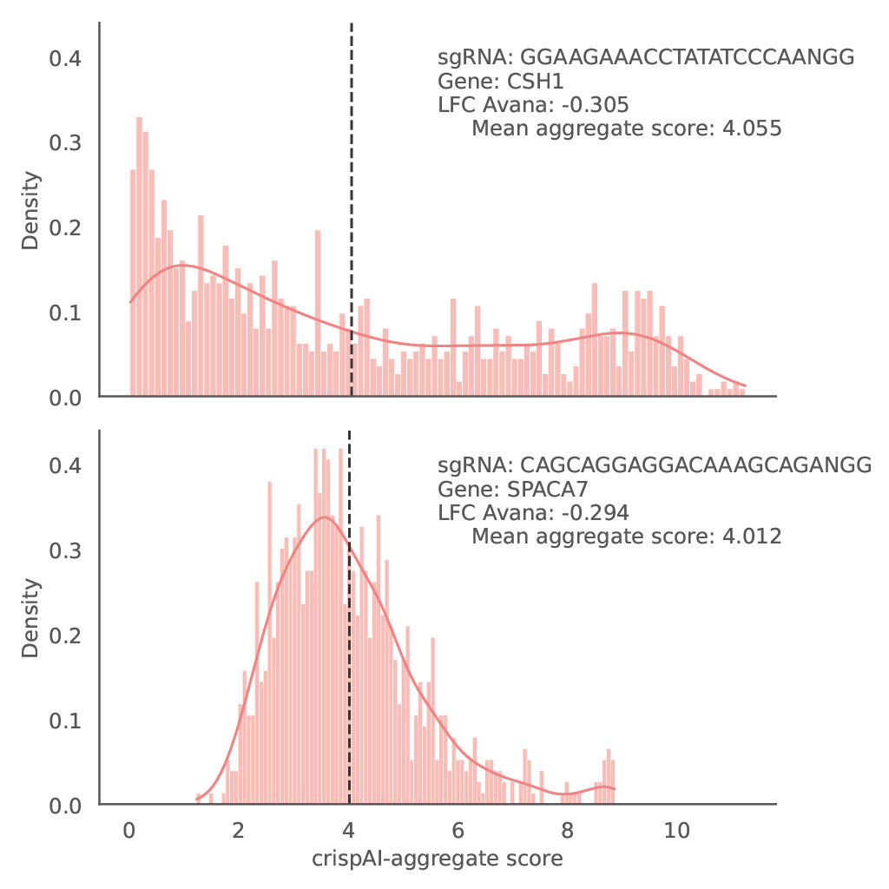

# Learning to quantify uncertainty in off-target activity for CRISPR guide RNAs

> crispAI is a deep learning-based tool that predicts the off-target cleavage activity for a given single guide RNA (sgRNA) and target DNA sequence pair and quantifies the uncertainty in off-target cleavage activity.
> crispAI-aggregate is an uncertainty aware genome-wide specificity score for sgRNA's.

> <a href="https://en.wikipedia.org/wiki/Deep_learning" target="_blank">**Deep Learning**</a>,  <a href="https://www.nature.com/articles/s41467-018-04252-2" target="_blank">**CRISPR-based genome editing**</a>, <a href="https://link.springer.com/content/pdf/10.1007/978-3-319-54339-0.pdf" target="_blank">**Uncertainty Quantification**</a>


---

## Authors

<a href="https://www.cs.ox.ac.uk/people/furkan.ozden/" target="_blank">**Furkan Ozden**</a> and <a href="https://www.cs.ox.ac.uk/people/peter.minary/" target="_blank">**Peter Minary**</a>

---

## Questions & comments 

[lastauthorname].[lastauthorsurname]@cs.ox.ac.uk

## Table of Contents 

> Warning: Please note that crispAI software is free for academic usage, while it is licenced for commercial usage. Please get in touch for more info.

- [Installation](#installation)
- [Usage](#usage)
- [Features](#features)
- [Citations](#citations)
- [License](#license)

---


## Installation

### Step-1: Download and untar USCS chroms required for Cas-OFFinder (if you do not plan to use crispAI-aggregate score you can skip this step).

Download target organism's chromosome FASTA files.

- http://hgdownload.soe.ucsc.edu/downloads.html (UCSC genome sequences library)

Extract all FASTA files in a directory and name it 'ucsc_chroms'.

For example (human chromosomes, in POSIX environment):

    $ wget http://hgdownload.soe.ucsc.edu/goldenPath/hg19/bigZips/chromFa.tar.gz
    $ mkdir -p /var/chromosome/human_hg19
    $ tar zxf chromFa.tar.gz -C /var/chromosome/human_hg19
    $ ls -al /var/chromosome/human_hg19
      drwxrwxr-x.  2 user group      4096 2013-10-18 11:49 .
      drwxrwxr-x. 16 user group      4096 2013-11-12 12:44 ..
      -rw-rw-r--.  1 user group 254235640 2009-03-21 00:58 chr1.fa
      -rw-rw-r--.  1 user group 138245449 2009-03-21 01:00 chr10.fa
      -rw-rw-r--.  1 user group 137706654 2009-03-21 01:00 chr11.fa
      -rw-rw-r--.  1 user group 136528940 2009-03-21 01:01 chr12.fa
      -rw-rw-r--.  1 user group 117473283 2009-03-21 01:01 chr13.fa
      -rw-rw-r--.  1 user group 109496538 2009-03-21 01:01 chr14.fa

Move obtained directory 'ucsc_chroms' to project folder ./crispAI_score

    $ mv ucsc_chroms ./crispAI_score

### Step-2: Use conda to create environment with required packages.
    
    $ conda env create -f env/crispAI_env.yml
    $ conda activate crispAI_env

### Step-3: Install required R packages for NuPoP library using R_environment.csv (optionally run restore_environment.R).
- Note: crispAI uses R version 4.2 to annotate target sites. You should have R version 4.2 installed on your system.

    $ cd env/
    $ Rscript restore_environment.R


### Step-4: Test installation by running on example input data, this will run with default parameters.

    $ python crispAI.py --input_file example_offt_input.txt --mode offt-score


---

## Usage 

### offt-score mode: Off-target cleavage activity prediction for sgRNA-target pairs.

- Input: See `example_offt_input.txt` file for example input.
- Command: 
```bash
python crispAI.py --mode offt-score --input_file example_offt_input.txt --N_samples 1000 --N_mismatch 4 --O crispAI_output.csv --gpu -1
```
- Arguments:
    - `--mode`: Mode of operation. Default is 'offt-score'.
    - `--input_file`: Input file name. Default is 'input.csv'.
    - `--N_samples`: Number of samples to draw from posterior distribution. Default is 1000. Range is [100, 2000].
    - `--N_mismatch`: Number of mismatches to search for off-target sites. Default is 4.
    - `--O`: Output file name. Default is 'crispAI_output.csv'.
    - `--gpu`: CUDA device number for GPU support. Default is -1 for CPU.

- Output: The output will be a CSV file with the following columns: `target_N`, `chr`, `start`, `end`, `strand`, `target_sequence`, `mean`, `samples`, `std`. Here is an example output row:

| target_N | chr | start | end | strand | target_sequence | mean | samples | std |
| --- | --- | --- | --- | --- | --- | --- | --- | --- |
| GGGTGGGGGGAGTTTGCTCCNGG | chr6 | 43769554 | 43769576 | - | GGGTGGGGGGAGTTTGCTCCTGG | 62.71200180053711 | 5,86,53,0,0,220,0,0,0,16,217 | 108.10479736328125 |




### agg-score mode: Aggregate off-target cleavage activity prediction for sgRNAs.

- Input: See `example_agg_input.txt` file for example input.
- Command: 
```bash
python crispAI.py --mode agg-score --input_file example_agg_input.txt --N_samples 1000 --N_mismatch 4 --O crispAI_aggregate_output.csv --gpu -1 --plot-agg
```
- Arguments:
    - `--mode`: Mode of operation. Default is 'offt-score'.
    - `--input_file`: Input file name. Default is 'input.csv'.
    - `--N_samples`: Number of samples to draw from posterior distribution. Default is 1000. Range is [100, 2000].
    - `--N_mismatch`: Number of mismatches to search for off-target sites. Default is 4.
    - `--O`: Output file name. Default is 'crispAI_output.csv'.
    - `--gpu`: CUDA device number for GPU support. Default is -1 for CPU.
    - `--plot-agg`: Flag to plot aggregate score distribution for sgRNAs. 

Replace the values in the command with your actual values when running the program. The values provided in the command are the default values. If you want to use the default values, you can omit them from the command. For example, if you want to use the default value for `--N_samples`, you can omit `--N_samples 1000` from the command. The program will automatically use the default value. If you want to use GPU, replace `-1` with your actual CUDA device number. If you want to plot the aggregate score distribution for sgRNAs in the agg-score mode, add `--plot-agg` flag.

- Output: The output will be a CSV file with the following columns: `sgRNA`, `aggregate_score_mean`, `aggregate_score_median`, `aggregate_score_std`, `N-samples`. Here is an example output row:

| sgRNA | aggregate_score_mean | aggregate_score_median | aggregate_score_std | N-samples |
| --- | --- | --- | --- | --- |
| GTCCCCTGAGCCCATTTCCTNGG | 3.7147998809814453 | 3.2274999618530273 | 1.9692000150680542 | 1.85,1.9,7.16,2.97,2.57,4.05,3.81,1.96,4.08,2.32,4.09,5.75 |



